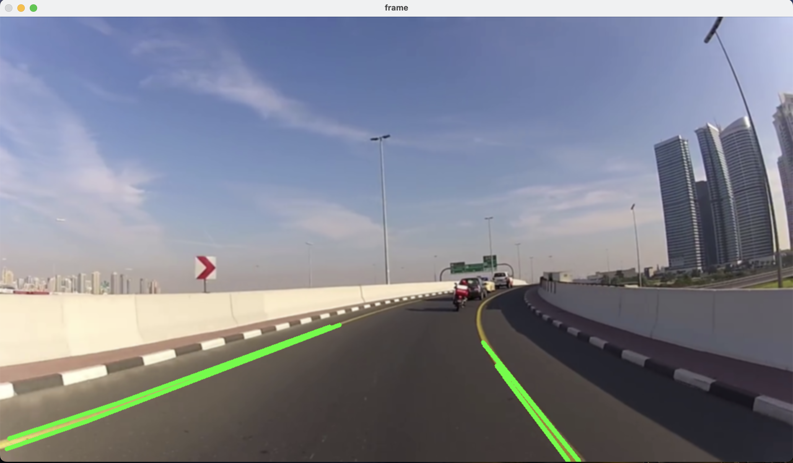

# Lane Detection for Autonomous Driving

## Overview

Welcome to the Lane Detection project! This project is a key step towards advancing autonomous driving technology. It focuses on detecting and highlighting driving lanes, which is crucial for navigating self-driving cars.

## Technologies Used

- **Python**: The backbone language for implementing the project.
- **OpenCV**: A powerful library for real-time computer vision, used for image processing and lane detection.
- **NumPy**: Utilized for efficient numerical operations, especially in image data manipulation.

## Technical Workflow

**Video Capture**: The project starts by capturing video footage to simulate a driver's road view.

```python
video = cv2.VideoCapture("path/to/video.mp4")
```

## Image Preprocessing

A crucial part of the lane detection process is preparing the images for analysis. This involves a few key steps to ensure accurate detection of the lanes:

**1. Gaussian Blur**: To reduce noise and smooth out the image, a Gaussian Blur is applied. This helps in minimizing false detections caused by minor imperfections in the video frames.

```python
frame = cv2.GaussianBlur(or_frame, (5,5), 0)
```

**2. Image Preprocessing:**
Apply Gaussian Blur to reduce noise.
Convert to HSV color space for effective color detection.

```python
frame = cv2.GaussianBlur(or_frame, (5,5), 0)
hsv = cv2.cvtColor(frame, cv2.COLOR_BGR2HSV)
```

**3. Color Masking:**
Create a mask to detect colors typical of road lane markings.

```python
lower_y = np.array([18,94,140])
upper_y = np.array([80,255,255])
mask = cv2.inRange(hsv, lower_y, upper_y)
```

**4.Edge Detection and Lane Identification:**
Use the Canny edge detector for edge detection.
Apply Hough Line Transform to identify lane lines.

```python
edges = cv2.Canny(mask, 74, 150)
lines = cv2.HoughLinesP(edges, 1, np.pi/180, 50, maxLineGap=50)
```

**5. Lane Highlighting:**
Highlight the detected lanes in the frames.
for line in lines:

```python
    x1, y1, x2, y2 = line[0]
    cv2.line(frame, (x1, y1), (x2, y2), (0, 255, 0), 5)
```

## Project Screenshot

Here's a look at the lane detection in action:


## Connection to AI and Autonomous Driving

This lane detection project isn't just about detecting lines on the road; it's a crucial step towards the future of AI in autonomous driving. By accurately identifying lanes, we're paving the way for smarter, safer self-driving cars. It's about making roads safer and navigation systems more reliable.

## Contact

Got questions or want to connect? Feel free to reach out!

- Email: [umerz@mcmaster.ca](mailto:umerz@mcmaster.ca)
- LinkedIn: [linkedin.com/in/zayed-umer](https://linkedin.com/in/zayed-umer)
- GitHub: [github.com/zayedu](https://github.com/zayedu)
- Portfolio: [notzayed.me](http://notzayed.me)
